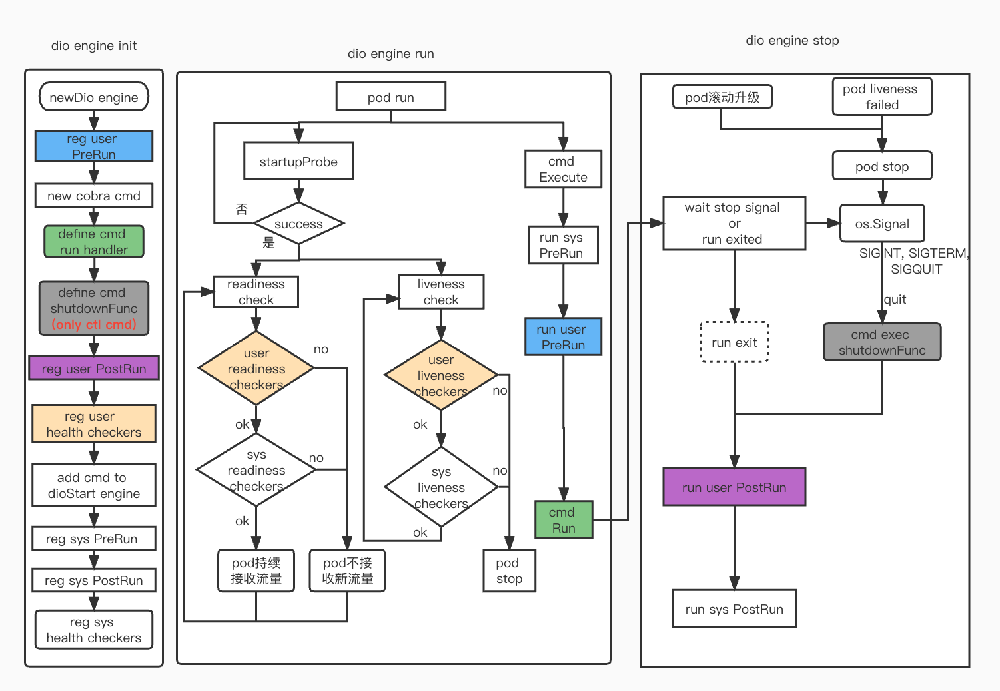
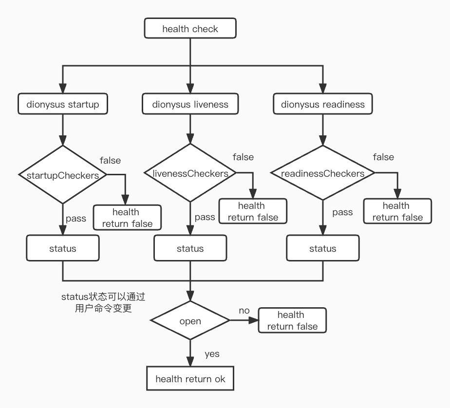

# dionysus

[](https://codecov.io/gh/gowins/dionysus)
[](https://github.com/gowins/dionysus/issues)
[](https://github.com/gowins/dionysus/blob/master/LICENSE)

## 概要
dionysus是一个集成实现了gin, ctl和grpc等服务等golang项目集。
基于cobra cmd实现，管理维护了gin, ctl和grpc等子cmd的生命周期。
并将默认加载log, config, trace和metrics等实现，方便服务管控。
并将提供orm, redis和grpool等一些工具包的封装方便使用。

## dionysus执行流程说明

dionysus执行流程执行流程如上图所示，有颜色的是用户可定义的行为，相应的颜色是对于的定义阶段和执行阶段。空白颜色的是框架定义的行为，不可更改。

1: dionysus初始化阶段  
1.1: 首先创建相应的子cmd(gin,ctl和grpc), 定义子cmd的run执行逻辑和shutdown关闭逻辑    
1.2: 创建dionysus框架，注册用户侧的PreRunE(在cmd的run之前执行)和PostRunE(在cmd的shutdown之后执行)  
1.3: 将子cmd注册进dionysus框架中，注册dionysus的PreRunE和PostRunE函数及注册相应类型的健康检查cmd  
1.4: wrap子cmd的rune, 管理子cmd的生命周期，识别SIGINT, SIGTERM, SIGQUIT信号的处理(适配k8s的pod退出流程)  

2: dionysus执行流程  
2.1: 执行框架注册的PreRunE函数  
2.2: 执行用户注册的PreRunE函数，可以执行服务依赖项的初始化，比如连接数据库等    
2.3: 执行wrap rune, 协程执行用户的rune函数并开始相应健康检查服务  
2.4: 等待rune执行完成或系统停止的signal  

3: dionysus停止流程  
3.1: 停止流程有两种情况，一种是rune执行完毕exit了，还有一种是接收到了(SIGINT, SIGTERM, SIGQUIT)停止信号  
如果接收到了停止信号，那么将会执行相应的shutdownFunc，如果是rune自己exit则不执行shutdownFunc  
3.2: 执行用户注册的PostRunE函数，可以执行服务停止后等清理工作  
3.3: 执行框架注册的PostRunE函数  

### gin cmd demo说明
demo参考[gin cmd demo](example/ginx/demo.go)

### ctl cmd demo说明
demo参考[ctl cmd demo](example/ctl/demo.go) 

## 健康检查实现
健康检查分为三种  
1: startup, 该健康检查主要定义何时开始健康  
2: liveness, 控制pod实例的存活，检查失败，则pod重启  
3: readiness, 控制pod实例的流量导入，检查失败，pod流量不在进入  
健康检查如上所示，框架提供了checker hook和状态开关。  
用户可以调用RegXXXCheckers注册相应的检查项，如检查依赖数据库的状态和依赖的上游服务的状态，  
来确认服务的健康状态。而状态开关status可以用户手动开关控制。当checker hook和状态开关开启时  
健康检查才能通过。

当前三种类型的cmd的会默认加载对应的health cmd, 健康检查统一执行exec命令：
```
startup: {$binary} startup
liveness: {$binary} liveness
readiness: {$binary} readiness
```

### gin health
如图所示在gin cmd中默认创建了/healthx group路由。  
在该/healthx路由组下分别注册了/startup，/liveness，/readiness三个路由。  
健康检查会定时访问这些路由，判断服务健康状态。  
在gin中还自定义了健康检查开关，比如通过访问/readiness/close路由  
```curl -i podip:port/healthx/readiness/close -XPOST```控制健康检查状态开关。  
当服务故障时，可手动实现服务流量隔离。  

### ctl health
会默认在ctl的启动go协程定时往一个默认文件写时间戳，健康检查会去定期检查这个时间戳是否正常。  
因为ctl没有流量的概念，所以它的checker hook只有liveness这种模式。  

### grpc health
grpc会在grpc server默认注册健康路由，来提供健康检查。通过发生对应的健康检查grpc请求来  
确认服务的健康状态。可以通过```HEALTH_STATUS=close {$binary} readiness```等命令控制健康检查状态开关。  

