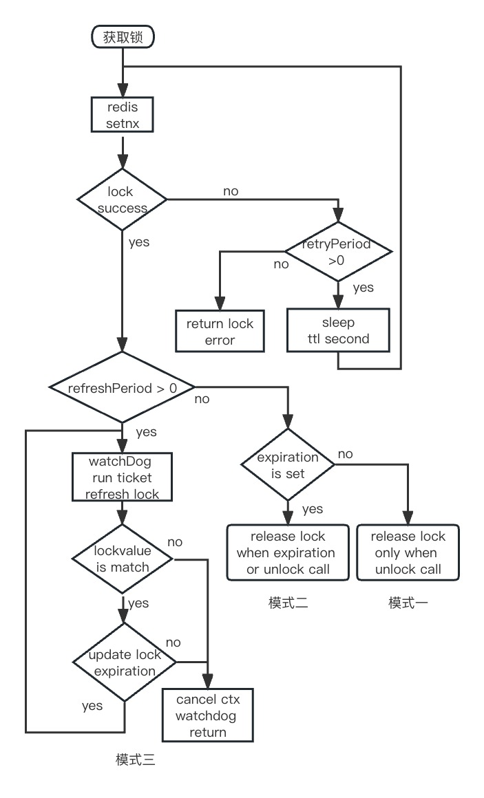
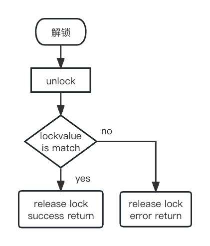

## 背景

在很多分布式场景，比如商品订单的生成，消息的单次消费等，需要保证同一时间下只能有一个进程进行同一个操作。目前在多副本状态下，需要实现以上能力需要有分布式锁的能力。

## 目标

独占性：同一时刻，同一把锁，对于不同运行实例副本只能被一个取锁方占用。

对称性：加锁和解锁及续期必须为同一身份，保证一致性。

可靠性：当持有锁的服务突然挂掉，为释放锁时，其它服务能够正常取到锁。

## 原理

通过redis的setnx的特性实现锁的独占性，用lua脚本执行的原子性来保证锁的对称性，redis的expire超时删除key的机制实现锁可靠性。

主要通过三种方式的锁：

模式一: 永不过期的锁，这种情况下，当持有锁的服务突然挂掉，锁可能为释放，有死锁的风险

模式二: 定时过期的锁，无看门狗自动续期。这种情况下，万一挂掉，到达时间后也会释放锁。但是对于正常超时这种情况，需要处理好业务的运行逻辑。

模式三: 定时过期的锁，有看门狗自动续期。这种情况只要服务不挂掉，锁会被一直续期。如果续期失败，将会执行cancel context。

### 加锁流程



### 解锁流程



### 使用举例

```text
redisCli := redis.NewClient(&redis.Options{})
// lockey代表在redis中的锁名，分布式服务中，同时只有一个实例可持有该锁名的锁
lockey := "diodemolockkey"
默认情况为模式一
rlock := New(redisCli, lockey)
rlock.Lock(context.Background())
defer rlock.Unlock(context.Background())
// do something

模式二
rlock := New(redisCli, lockey, WithExpiration(10*time.Second))
rlock.Lock(context.Background())
defer rlock.Unlock(context.Background())
// do something

模式三
rlock := New(redisCli, lockey, WithExpiration(10*time.Second), WithWatchDog(7*time.Second))
rlock.Lock(context.Background())
defer rlock.Unlock(context.Background())
// do something
```

### 配置说明

```text
retryPeriod: 当获取锁失败是，重新尝试获取锁的间隔时间，默认为1秒。
expiration: 锁的过期时间，超过该时间，redis中会删除该锁的持有，默认为0，表示永不过期，注意这种情况下，程序异常退出为释放锁的话，会造成死锁的情况。
refreshPeriod: 锁的续期时间间隔，该值必须大于expiration，默认为0，表示不开启自动续期锁的过期时间。建议该值配为expiration-3*second左右。
```

