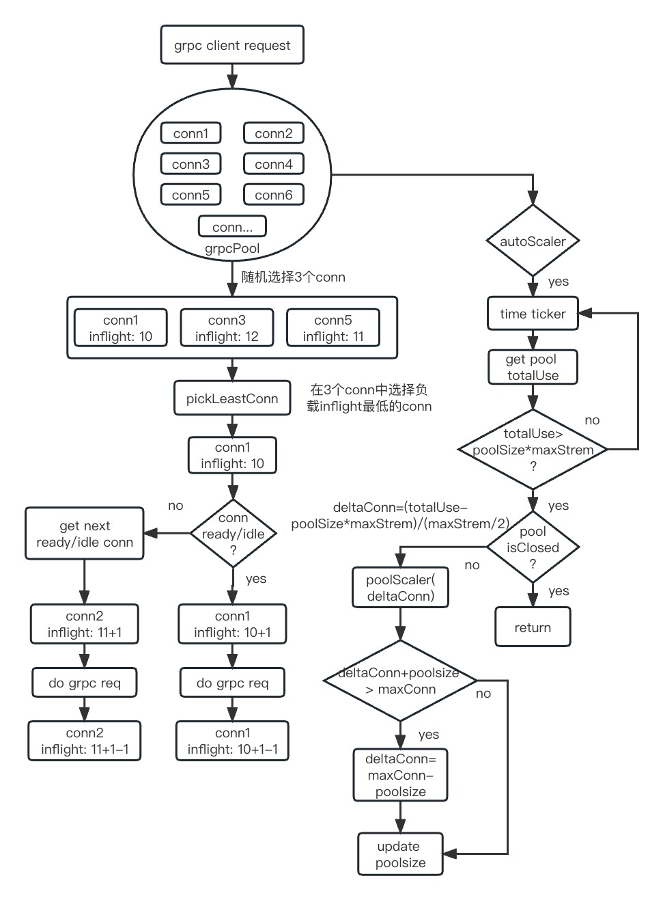

## 设计目标：

设计一个grpc客户端的连接池，尽量对使用者无感知。实现连接的复用及负载均衡能力。当连接池达到预期的maxStream负载时，具备自动扩容能力。缩容由于需要close conn。对于stream类型请求不好处理，暂时不考虑。提升grpc客户端连接的容灾，稳定及性能。

## 基本原理：



总体实现，如上图所示。grpcpool实现了grpc clientconn interface的Invoke和NewStream方法。所以对于使用者来说，只需将grpc clientconn替换为grpcpool。grpc客户端发起请求时，grpcpool会从连接池里随机选择三个连接，在这三个连接中选择inflight负载最低的conn1，判断conn1是否ready或idle状态, 如果不为ready或idle则从连接池找到一个ready或idle到conn。选定conn后，conn使用负载inflight+1，grpc request完成后，则conn使用负载inflight-1恢复。

注意：关于idle状态的conn的使用可以参照[__grpc状态文档__](https://grpc.github.io/grpc/core/md_doc_connectivity-semantics-and-api.html)：`New RPCs MAY be created in IDLE state. `在这个状态下可以发起新的rpc请求。

扩容逻辑：启动协程定时检查grpcPool的负载情况，如果totalUse>poolSize*maxStrem，则开启扩容，扩容算法deltaConn=(totalUse-poolSize*maxStrem)/(maxStrem/2)。最大的扩容上限为maxconn。扩容能力默认关闭，需要显示声明启动。

## 使用举例：

```go
addr := "127.0.0.1:8081"
gPool, err := GetGrpcPool(addr, WithScaleOption(DefaultScaleOption), WithPoolSize(30))
if err != nil {
	t.Errorf("grpc pool init dial error %v", err)
	return
}
c := testpb.NewGreeterClient(gPool)
_, err = c.SayHelloTest3(context.Background(), &testpb.HelloRequest{Name: "nameing1"})
if err != nil {
	t.Errorf("get rsp failed")
	return
}
```

### 相关配置说明：

1:  poolSize， 连接池维持连接数大小，如果开启了自动扩容，那么当发生扩容行为时，该值会变更，当前默认值为3，通过WithPoolSize变更。

2: dialOptions，grpc conn连接配置，通过WithDialOptions变更，当前有如下默认值：

```text
InitialWindowSize: 256M 基于Stream的滑动窗口，类似于TCP的滑动窗口。
InitialConnWindowSize: 256M 基于Connection的滑动窗口
KeepAliveTime: 每隔KeepAliveTime时间，发送PING帧测量最小往返时间，确定空闲连接是否仍然有效，默认设置为10秒。
KeepAliveTimeout: 超过KeepAliveTimeout，关闭连接，默认设置为3秒。
PermitWithoutStream: 当连接空闲时是否发送PING帧监测，默认设置为true。
MaxSendMsgSize: 单条发送消息最大字节数，默认设置为1GB。
MaxRecvMsgSize: 单条接收消息最大字节数，默认设置为1GB。
DefaultDialTimeout: 连接超时，默认设置为3秒。
```

3: scaleOption，连接池扩容配置，扩容能力默认关闭。当前默认值如下所示：

```text
ScalePeriod: 扩容检查周期，默认为30秒
MaxConn: 连接池最大连接数限制，当前默认值为300，如果达到上限值时，连接会继续复用，不会扩容
DesireMaxStream: 期望最大连接复用数，当总体超过这个值时，触发扩容，当前默认值为80
```

## 压测数据

### 性能测试

客户端 10C6G的pod, 服务端 4C2G  3个pod

开启连接池

| 连接池连接数 | 请求数(w) | 并发数 | 请求时间(ms) | qps   | 数据大小 |
| ------ | ------ | --- | -------- | ----- | ---- |
| 1      | 200    | 100 | 62632    | 31932 | 66B  |
| 3      | 200    | 100 | 31185    | 64133 | 66B  |
| 6      | 200    | 100 | 31678    | 63135 | 66B  |
| 12     | 200    | 100 | 33475    | 59746 | 66B  |
| 1      | 600    | 300 | 191419   | 31345 | 66B  |
| 3      | 600    | 300 | 84265    | 71203 | 66B  |
| 6      | 600    | 300 | 87539    | 68541 | 66B  |
| 12     | 600    | 300 | 93597    | 64104 | 66B  |
| 1      | 200    | 100 | 75645    | 26439 | 4KB  |
| 3      | 200    | 100 | 40947    | 48843 | 4KB  |
| 6      | 200    | 100 | 39067    | 51194 | 4KB  |
| 12     | 200    | 100 | 41796    | 47851 | 4KB  |
| 1      | 600    | 300 | 227221   | 26406 | 4KB  |
| 3      | 600    | 300 | 120056   | 49976 | 4KB  |
| 6      | 600    | 300 | 124915   | 48032 | 4KB  |
| 12     | 600    | 300 | 129658   | 46275 | 4KB  |

无连接池

| 请求数(w) | 并发数 | 请求时间(ms) | qps   | 数据大小 |
| ------ | --- | -------- | ----- | ---- |
| 200    | 100 | 63726    | 31384 | 66B  |
| 600    | 300 | 193919   | 30941 | 66B  |
| 200    | 100 | 75083    | 26637 | 4KB  |
| 600    | 300 | 229772   | 26113 | 4KB  |

### 稳定性测试

请求过程中server端grpc 3 pod滚动，开启扩容状态时，扩容条件为DesireMaxStream>20

| 连接池连接数 | 请求数(w) | 并发数 | 请求时间(ms) | 报错  | 数据大小 | 扩容(stream>20) |
| ------ | ------ | --- | -------- | --- | ---- | ------------- |
| 3      | 600    | 300 | 120998   | 0   | 4KB  | 关闭            |
| 18     | 600    | 300 | 138381   | 0   | 4KB  | 关闭            |
| 120    | 600    | 300 | 177486   | 0   | 4KB  | 关闭            |
| 300    | 600    | 300 | 165212   | 0   | 4KB  | 关闭            |
| 3      | 600    | 300 | 136085   | 0   | 4KB  | 3-->27        |
| 6      | 600    | 300 | 134113   | 0   | 4KB  | 6-->23        |
| 12     | 600    | 300 | 132245   | 0   | 4KB  | 12-->17       |

