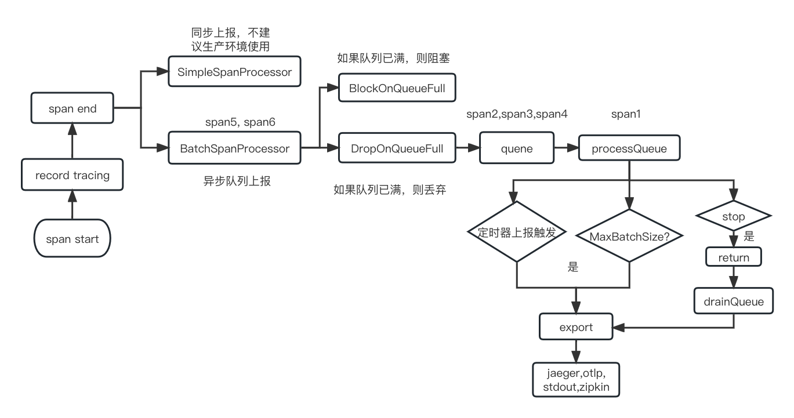

# opentelemetry 模块介绍
> 此模块主要封装opentelemetry相关功能，在dionysus的gin和grpc中注入相关的trace逻辑。
> 并提供相关的http client和grpc client的tracer版本。
> 基于dionysus框架实现tracer的初始化及停止步骤。

## 使用
一些常见的使用常见可参考[example/opentelemetry](../example/opentelemetry/otm.go) 目录。  
opentelemetry的使用，首先需要在dionysus框架中注入tracer的启动及停止步骤
###  框架初始化
```go
import "github.com/gowins/dionysus/opentelemetry"
dio := dionysus.NewDio()
preSteps := []step.InstanceStep{
	{
		StepName: "initOtm", 
		Func: func() error} {
		otm.Setup(otm.WithServiceInfo(&otm.ServiceInfo{
			Name:      "dioName", 
			Namespace: "dioNamespace", 
			Version:   "dioVersion",
		}), otm.WithTraceExporter(&otm.Exporter{
			ExporterEndpoint: otm.DefaultStdout, //后续具体对接相应实例 
			Insecure:         false,
			Creds:            otm.DefaultCred,}), 
			otm.WithSampleRatio(1.0)) // 设置采样率，ParentBased采样策略，默认值为100%
			return nil
		}
}
d.PreRunStepsAppend(preSteps...)
postSteps := []step.InstanceStep{
	{
		StepName: "stopOtm", Func: func() error {
			otm.Stop()
			return nil
		},
	},
}
d.PostRunStepsAppend(postSteps...)
```
### http client带trace
```go
opts := []oteltrace.SpanStartOption{
	oteltrace.WithAttributes(attribute.String("httpCli", "name")), 
	oteltrace.WithSpanKind(oteltrace.SpanKindClient),
}
// 如果context有span，那么span会以old span为parent，反之则span为root span
// 还有一种方式是从context中取出span： `span := oteltrace.SpanFromContext(context)`, 这种情况下的span不用end
ctx, span := otm.SpanStart(context, "httpReq", opts)
// 如果是调用SpanStart创建了新的span，一定要end，不然会内存泄露，end调用后会将这次trace span放到上报队列中
defer span.End()
request, _ := http.NewRequestWithContext(ctx, http.MethodGet, url, nil)
// 创建带tracer的http client
httpclient.NewWithTracer()
rsp, err := httpClient.Do(request)
```
### grpc client带trace
```go
// 必须使用NewConnWithTracer
grpcConn, _ := client.NewConnWithTracer("grpcServiceName")
c := hw.NewGreeterClient(grpcConn)
opts := []oteltrace.SpanStartOption{
	oteltrace.WithAttributes(attribute.String("GrpcCli", "name")),
	teltrace.WithSpanKind(oteltrace.SpanKindClient),
}
ctx, span := otm.SpanStart(context.Background(), "grpcReq", opts...)
defer span.End()
r, err := c.SayHello(ctx, &hw.HelloRequest{Name: "nameing"}))
```

## trace采用说明
### trace上报流程

目前我们采用异步队列BatchSpanProcessor方式上报数据  
采集到的span发送到本地缓冲区队列中，目前队列长度MaxQueueSiz我们设置为2048，当达到队列最大长度未处理时，为了保证不影响服务的可用性，我们使用DropOnQueueFull方式，队列满时，丢弃trace。  
队列触发上报有三种情况:  
1: 达到定时器时间BatchTimeout，当前我们设置为5秒。  
2: 达到batch批处理数量MaxExportBatchSize，当前我们设置为512。   
3: trace stop，调用drainqueue也发触发上报。此时会将stop之前到的trace将会上报，而stop之后新产生的trace丢弃。  
上诉配置通过`WithTraceBatchOptions(WithMaxQueueSize,WithMaxExportBatchSize,WithBatchTimeout)`等进行变更
### trace采样率
目前我们开启采样率默认是100%，可以通过`WithSampleRatio(ratio)`更改配置，我们采用的采样策略是`ParentBasedSample`。顾名思义，如果当前span是没有parent的rootspan，那么会根据配置的采样率采样。如果当前span有parent。那个会根据parent的span采样结果来确定当前span是否被采集。如果parent的span被采集，则当前span也会被采集，反之则不采集。

## 压力测试：
后端2个最大6c3G可用资源的http pod压测对比数据如下所示。
### 开启trace

| 请求数     | 连接数  | 服务qps    | 失败请求 | trace记录 | cpu(m) | mem(Mi) |
| ------- | ---- | -------- | ---- | ------- | ------ | ------- |
| 1000000 | 300  | 14041.12 | 0    | 1000000 | 2050*2 | 41*2    |
| 1000000 | 500  | 13700.29 | 0    | 1000000 | 1965*2 | 43*2    |
| 1000000 | 1000 | 12889.05 | 0    | 1000000 | 1833*2 | 53*2    |

### 关闭trace

| 请求数     | 连接数  | 服务qps    | 失败请求 | cpu(m) | mem(Mi) |
| ------- | ---- | -------- | ---- | ------ | ------- |
| 1000000 | 300  | 14559.79 | 0    | 1503*2 | 27*2    |
| 1000000 | 500  | 14191.16 | 0    | 1422*2 | 28*2    |
| 1000000 | 1000 | 13175.25 | 0    | 1359*2 | 42*2    |